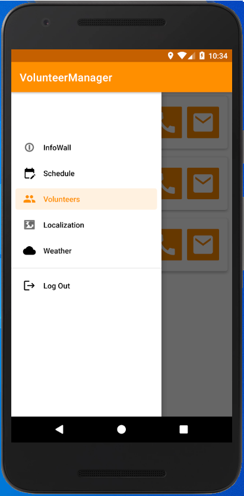
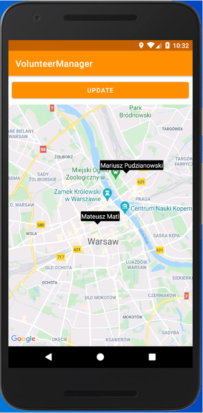

# Volunteer Manager

Zazwyczaj na festiwalach dany koordynator odpowiedzialny jest za dany obszar działania np. za parkingi
czy za pomoc prelegentom, mając do dyspozycji ludzi pracujących w wolontariacie.
W celu usprawnienia działań na poziomie koordynatorów aplikacja będzie zawierać:
- Tablice ważnych informacji/ostrzeżeń (dodawanych przez koordynatorów).
- Możliwość dzwonienia i odbierania SMS z poziomu aplikacji, tak by można było odseparować swoje prywatne kontakty od wolontariuszy.
- Informacje o pogodzie (zazwyczaj tereny festiwalów są otwarte, zatem informacje pogodowe np. o burzach pomogą zapewnić bezpieczeństwo i szybszy czas reakcji).
- Mapę i ostatnie położenie koordynatora (pomocne, gdy teren festiwalu jest bardzo duży, a chce się znaleźć i spotkać danego koordynatora np. by przekazać mu jakiś sprzęt).
- Harmonogram pracy wolontariuszy (godziny pracy, kto aktualnie jest na zmianie). 
  
Technologia: Android (Kotlin), Firebase,  API pogodowe, API Google Maps.

 
*Panel na wigacyjny aplikacji.*  
 
*Widok mapy z położeniami koordynatorów.*